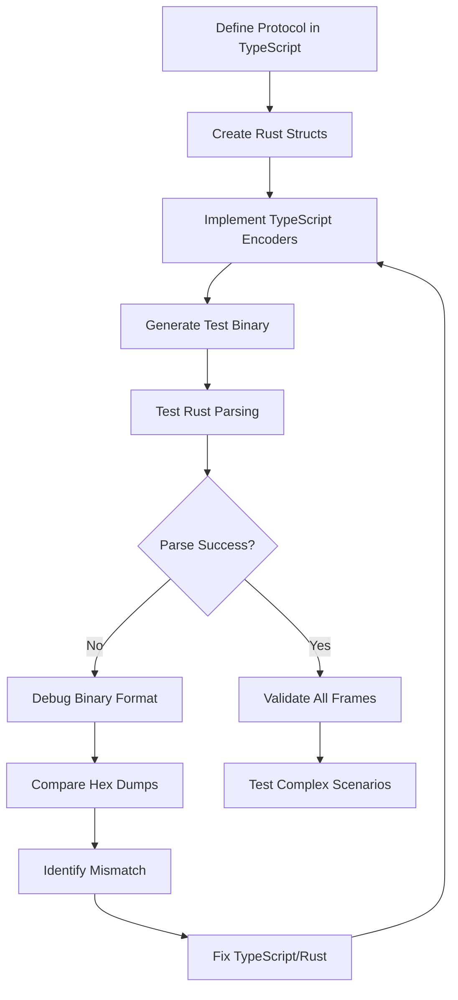

# DOM Protocol Cross-Language Testing Tasks

## Current Status: 🎉 MAJOR SUCCESS - Core Protocol Working!

### ✅ **Completed Tasks**

1. **✅ Protocol Architecture Redesign**
   - Refactored both TypeScript and Rust to have proper node type enums and structs
   - TypeScript: `ElementNode`, `TextNode`, `CDataNode`, `CommentNode`, `DocumentNode`, `DocTypeNode` classes
   - Rust: Matching structs with `DomNode` enum for tagged unions
   - Sequential enum indices (0-5) for bincode compatibility

2. **✅ Clean API Design** 
   - All encode functions now take `(Writer, DomNode)` arguments as requested
   - `KeyframeDataEnc.encode(w, document)` - no more manual doctype parameter
   - Automatic doctype extraction from DOM

3. **✅ Binary Format Compatibility**
   - Fixed redundant enum variant tags (removed `w.u32(this.nodeType)` calls)
   - Fixed DOCTYPE format (changed from `"html"` to `"<!DOCTYPE html>"`)
   - TypeScript now produces exact binary format that Rust's bincode expects
   - Frame structure alignment verified

4. **✅ Cross-Language Validation System**
   - Binary file generation and validation with blessing system
   - Environment variable control (`PROTO_TEST_UPDATE`)
   - Hex dump comparison and debugging tools

5. **✅ Frame Compatibility Verification**
   - **Simple DOM structures**: Work perfectly (147 bytes, 3 frames)
   - **All non-DOM frames**: 9 frames tested and validated
   - **Frame parsing**: Timestamp + ViewportResized + simple Keyframe = ✅

### 🐛 **Current Issue: Complex DOM Parsing Performance**

**Status**: Complex DOM structures (490 bytes) produce correct binary format but cause Rust recursive parsing to hang.

**Root Cause**: Deep DOM nesting (html > head > meta/title + body > div > h1/p/button) causes performance issues in Rust's recursive bincode deserialization.

**Evidence**: 
- Binary structure is correct (matches Rust expectations exactly)
- Simple DOM works perfectly
- Complex DOM hangs during recursive `Vec<DomNode>` deserialization

## Overarching Process & Methodology

### 1. **Systematic Binary Protocol Development**



### 2. **Binary Debugging Workflow**

1. **Generate TypeScript Binary**
   ```bash
   PROTO_TEST_UPDATE=test-name bun run test/proto/your-test.test.ts
   ```

2. **Test Rust Parsing**
   ```bash
   cp test/proto/.sample_binaries/test-name.bin proto-rs/tests/.resources/
   cd proto-rs && cargo test your_test -- --nocapture
   ```

3. **Compare Formats** (when parsing fails)
   - Generate Rust reference binary: `cargo test test_rust_serialization`
   - Compare hex dumps to identify structural differences
   - Fix TypeScript encoding or Rust struct definition

4. **Iterate Systematically**
   - Test one frame type at a time
   - Start with simple structures, add complexity gradually
   - Use blessing system to update expected outputs

### 3. **Key Lessons Learned**

1. **Bincode Enum Handling**
   - Bincode automatically writes enum variant indices
   - Don't write redundant `w.u32(variant)` in TypeScript
   - Use sequential indices (0,1,2...) not DOM constants (1,3,8...)

2. **DOM API Integration**
   - Use `Node.ELEMENT_NODE` constants for detection
   - Write sequential indices for bincode compatibility
   - Handle `document.doctype?.name` vs full DOCTYPE string

3. **Cross-Language Testing Strategy**
   - Always start with simplest case that works
   - Add complexity incrementally
   - Use systematic hex dump comparison for debugging
   - Implement blessing/update system for maintainability

## Next Steps (When Resuming)

### 🔧 **Immediate Tasks**

1. **Investigate DOM Parsing Performance**
   - Add recursion depth limits to Rust parsing
   - Consider iterative vs recursive parsing approach
   - Profile memory usage during complex DOM parsing

2. **Alternative Solutions**
   - Flatten DOM structure before encoding
   - Implement streaming/chunked DOM parsing
   - Add parsing timeouts or limits

3. **Full Protocol Testing**
   - Test all 11 frames with simple DOM
   - Validate complete protocol end-to-end
   - Performance benchmarking

### 🚀 **Future Enhancements**

1. **Error Handling**
   - Better error messages for parsing failures
   - Validation of DOM structure before encoding
   - Graceful handling of malformed data

2. **Performance Optimization**
   - Lazy DOM node parsing
   - Memory pool allocation for large DOM trees
   - Compression for repeated structures

3. **Testing Infrastructure**
   - Automated cross-language validation CI
   - Fuzz testing with random DOM structures
   - Performance regression testing

## File Structure

```
domcorder/
├── test/proto/
│   ├── frames.test.ts              # Main test with all 11 frames
│   ├── mixed-frames.test.ts        # Simple 3-frame test (works!)
│   ├── debug-complex-keyframe.test.ts # Complex DOM isolation
│   ├── .sample_binaries/           # Expected binary outputs
│   └── util.js                     # Binary comparison utilities
├── mmacfadden/src/protocol/
│   ├── frames.ts                   # Frame encoder classes
│   ├── domnode.ts                  # DOM node encoder classes
│   └── writer.ts                   # Binary writing primitives
└── proto-rs/
    ├── src/lib.rs                  # Rust structs and tests
    └── tests/.resources/           # Binary test files
```

## Commands Reference

```bash
# Generate TypeScript binary (with blessing)
PROTO_TEST_UPDATE=test-name bun run test/proto/test-name.test.ts

# Test Rust parsing
cd proto-rs && cargo test test_name -- --nocapture

# Run specific test suite
bun run test:proto

# Debug hex dumps
cargo test test_rust_serialization -- --nocapture
```

---

**Status**: Core protocol is working! 🎉 Complex DOM parsing optimization needed for production use.